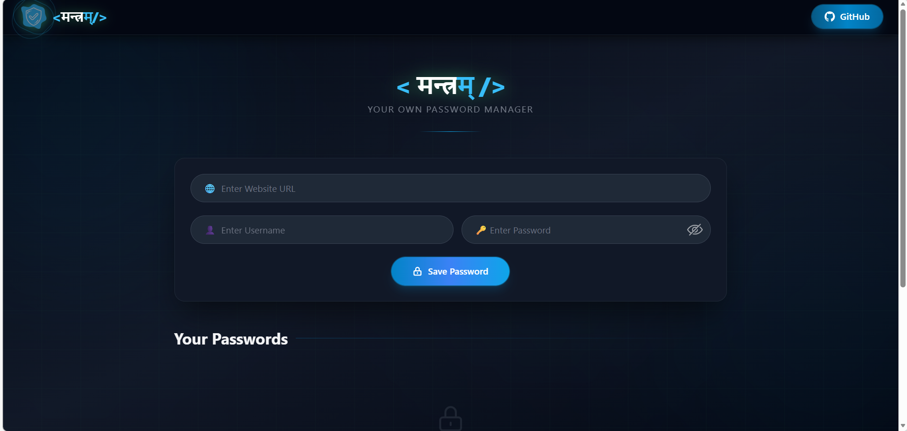
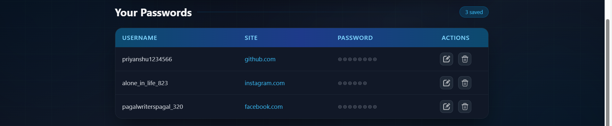
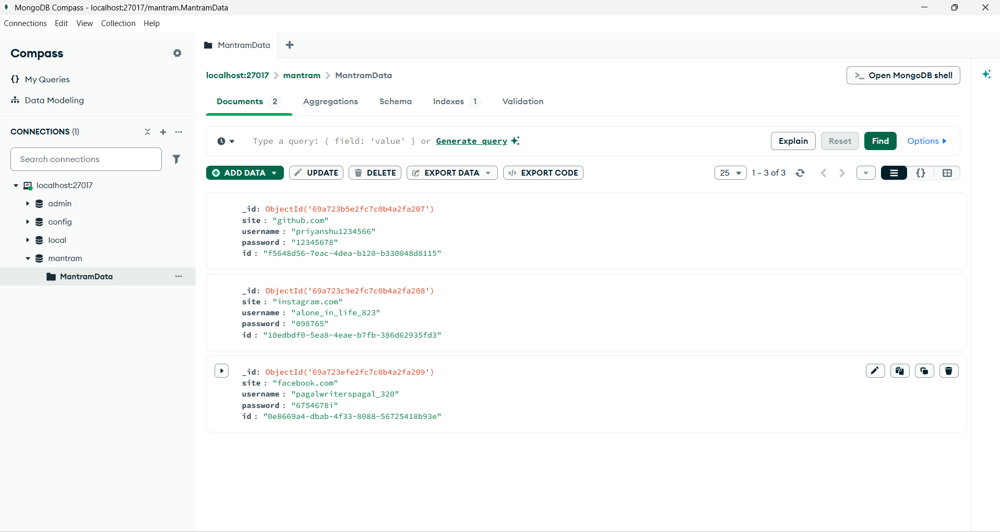
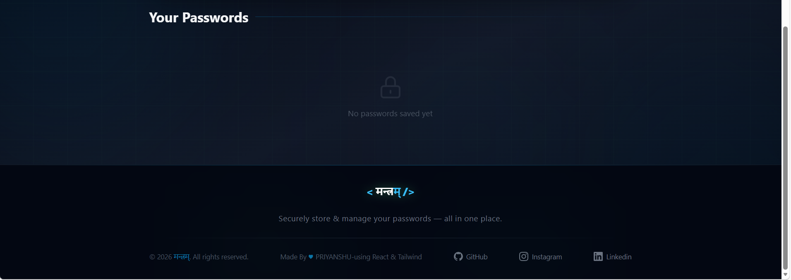

# 🚀 Mantram MongoDB Web Application

<p align="center">
  <a href="https://mantram-mongo-db.vercel.app/">
    
  </a>
  
  
  
  
  
</p>

---

## 🌐 Live Demo

🔗 **Production URL:**  
👉 https://mantram-mongo-db.vercel.app/

---

# 📌 Project Overview

**Mantram MongoDB Web Application** is a full-stack CRUD application built using modern web technologies.  

It demonstrates:
- REST API integration
- MongoDB database operations
- Full frontend-backend communication
- Production deployment workflow

This project is designed following scalable architecture principles and clean coding standards.

---

# 🛠 Tech Stack

## 🎨 Frontend
- ⚛️ React.js
- ⚡ Vite
- 🎨 Tailwind CSS
- 📡 Axios
- 🧹 ESLint

## 🌐 Backend
- 🟢 Node.js
- 🚏 Express.js
- 🍃 MongoDB
- 🔐 dotenv

## ☁️ Deployment
- Frontend: **Vercel**
- Backend: Render / Railway / VPS
- Database: MongoDB Atlas

---

# ✨ Core Features

- ✅ Create Data
- ✅ Read Data
- ✅ Update Data
- ✅ Delete Data
- 🔄 Real-time UI updates
- ⚡ Fast HMR with Vite
- 🔐 Secure environment variables
- 🌍 RESTful API Architecture

---

# 🖼 Screenshots

> 📌 Add your screenshots inside a `/screenshots` folder in your project

## 🏠 Home Page


## ➕ Create Data


## 📋 Data Listing


## ✏️ Update Feature


---

# 📂 Project Structure

```
Mantram-MongoDB/
│
├── client/              # React Frontend
│   ├── src/
│   ├── public/
│   └── package.json
│
├── server/              # Express Backend
│   ├── index.js
│   ├── routes/
│   ├── models/
│   └── package.json
│
└── README.md
```

---

# ⚙️ Installation Guide

## 1️⃣ Clone Repository

```bash
git clone https://github.com/your-username/your-repo-name.git
cd your-repo-name
```

---

## 2️⃣ Backend Setup

```bash
cd server
npm install
```

Create `.env` file inside `server` folder:

```
PORT=5000
MONGO_URI=your_mongodb_connection_string
```

Start backend:

```bash
npm start
```

---

## 3️⃣ Frontend Setup

```bash
cd client
npm install
npm run dev
```

Frontend runs at:

```
http://localhost:5173
```

---

# 📊 API Documentation

Base URL (Local):
```
http://localhost:5000/api
```

---

## 📌 1. Get All Records

```
GET /api/items
```

### Response:
```json
[
  {
    "_id": "12345",
    "name": "Sample Data",
    "createdAt": "2026-03-01"
  }
]
```

---

## 📌 2. Create Record

```
POST /api/items
```

### Body:
```json
{
  "name": "New Item"
}
```

---

## 📌 3. Update Record

```
PUT /api/items/:id
```

### Body:
```json
{
  "name": "Updated Name"
}
```

---

## 📌 4. Delete Record

```
DELETE /api/items/:id
```

---

# 🚀 Production Deployment

### Frontend (Vercel)
- Connect GitHub repo
- Set build command: `npm run build`
- Output directory: `dist`

### Backend
- Deploy on Render / Railway
- Add environment variables
- Connect MongoDB Atlas

---

# 🔮 Future Enhancements

- 🔐 JWT Authentication
- 👤 User Login / Register
- 📊 Admin Dashboard
- 🌈 Advanced UI Animations
- 🧪 Unit & Integration Testing
- 📦 TypeScript Migration

---

# 👨‍💻 Author

**PRIYANSHU KUMAR**

📧 Connect with me for collaboration  
⭐ If you like this project, give it a star!

---

# 📜 License

This project is licensed under the MIT License.
